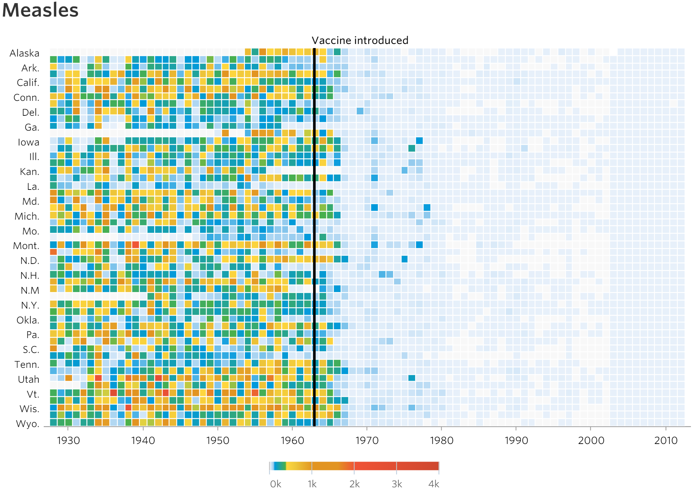

```{r, eval=FALSE, echo=FALSE, message=FALSE}
# **This only needs to be done once** - the packages will be on your computer once installed, and can be loaded with `library`.
if (!requireNamespace("BiocManager", quietly = TRUE))
    install.packages("BiocManager")
BiocManager::install(c("knitr", "Hiiragi2013", "Hmisc"))
```

# Introduction  

Welcome to High-Quality Graphics in R!
In our work, we often use visualizations in two ways: On the one hand, we use 
them as an exploratory tool to get an overview of our data as quickly and 
efficiently as possible. On the other hand, especially in our publications, we 
want to create highly individualized figures that make a professional impression 
and convey as quickly as possible the information we want to communicate to the 
readers of our publications.

You can find a particularly impressive example of a good visualization here:



# Plotting in base R  

When installing base R, some dummy/training data sets are made available, which 
we can easily use by loading the data into memory.

In this example, we use the `DNase` data set, which is, roughly speaking, a 
quantification of the activity of DNase.

Let´s have a look at the first couple of rows of our data.

```{r}
head(DNase)
```

The object DNase is a data frame whose columns are Run, the assay run; conc, 
the protein concentration used; and density,  the measured optical density.

Using the `plot` function, we can easily visualize two of the variables in our 
data set.

```{r, fig.wide = TRUE}
plot(DNase$conc, DNase$density)
```

This plot is not particularly visually appealing but serves the purpose of 
quickly exploring your data.

You can easily add some information to this base plot. The axis labels can be 
changed using the `xlab` and `ylab` arguments. `pch` determines the type of 
symbol you will use for plotting (1 = circles, 2 = triangles, etc.).

```{r, fig.wide = TRUE}
plot(DNase$conc, DNase$density,
  ylab = attr(DNase, "labels")$y,
  xlab = paste(attr(DNase, "labels")$x, attr(DNase, "units")$x),
  pch = 3,
  col = "blue")
```

We can also use other types of plots, usually by calling them by their name.

```{r, fig.wide = TRUE}
hist(DNase$density, breaks=25, main = "")
```

<div class="alert alert-warning">
**Exercise:**

Create a box plot that shows the assay runs on the x-axis and the optical
density on the y-axis!

**Note:** You should use the formula notation for this.

```{r, fig.wide = TRUE}
boxplot(density ~ Run, data = DNase)
```
</div>

This way of displaying your data is convenient, but you will quickly reach the 
limits of what is possible. If you want to create highly individual 
figures for your publications, base R plotting will often not be sufficient.

# Example data set  

To illustrate the functionality of `ggplot2`, we use, among others, a gene 
expression microarray data set that contains the transcriptomes of about 100 
cells from mouse embryos at different time points in early development.

```{r, message=FALSE}
library("Hiiragi2013")
data("x")
dim(Biobase::exprs(x))
```

# ggplot2  

First, we need to load the infamous package ggplot2.

```{r}
library("ggplot2")
```

Next, almost as easily as in base R, we can create a plot of two variables. 
We use the `ggplot2` package by Hadley Wickham, which is based on the grammar of 
graphics (more on this later). First, we specify which data we want to work 
with. Then we name the aesthetics, i.e., which variables should be mapped to the
x-axis or y-axis. And last but not least, we can specify the geometries, i.e., 
how the data is represented in the coordinate system.

```{r, fig.wide = TRUE}
ggplot(DNase, aes(x = conc, y = density)) + geom_point()
```

Again, we can look at the first six rows of the example data set using the 
`head` function. Inside the `head` function, we apply the `pData` function, 
which retrieves meta-data from an expression data set. In this case, we retrieve 
phenotypic data.

```{r}
head(pData(x), n = 6)
```

One of the most important aspects of data visualization is the appropriate 
preparation of the data set in R. A package that can be particularly helpful 
is `dplyr`. 

```{r, message=FALSE}
library("dplyr")
```

Using the `group_by` function from the `dyplr` package, you can group your data 
frame by one or more variables. Next, we pipe the output of the `group_by` 
function into the `summarise` function, which will summarise the grouped data 
frame. More specifically, we use the `n` function, which gives the size of each 
group.

```{r}
groups <- group_by(pData(x), sampleGroup) %>%
  summarise(n = n(), color = unique(sampleColour))
groups
```

We can now plot the newly created grouped variables in a bar plot by specifying
the corresponding variables and the `geom_bar` geometry.

```{r, fig.wide = TRUE}
ggplot(groups, aes(x = sampleGroup, y = n)) +
  geom_bar(stat = "identity")
```

<div class="alert alert-warning">
**Exercise:**

Try to produce a horizontal barplot!

```{r, fig.wide = TRUE}
ggplot(groups, aes(x = n, y = sampleGroup)) +
  geom_bar(stat = "identity")
```
</div>


Your publications make a good impression if you consistently use certain color 
schemes throughout, with different groups always having the same color. We use 
the vector with colors already available in the data set.

```{r}
groupColor <- setNames(groups$color, groups$sampleGroup)
```

<div class="alert alert-info">

If you want to make your plots colorblind-friendly, I can recommend the 
following series of blog post.

https://blog.datawrapper.de/colorblindness-part1/

Also, you can have a look at the `colorblindr` package:


remotes::install_github("wilkelab/cowplot")  
install.packages("colorspace", repos = "http://R-Forge.R-project.org")

</div>

We can add the colors by first adding the `fill` argument to the aesthetics 
function. To manually set the colors, we can add another layer to our plot using 
the `+` symbol and the `scale_fill_manual` function.

```{r, fig.wide = TRUE}
p <- ggplot(groups, aes(x = sampleGroup, y = n, fill = sampleGroup)) +
        geom_bar(stat = "identity") +
        scale_fill_manual(values = groupColor, name = "Groups") 
p
```

Now, we still have the problem of overlapping bar labels. Adding another layer, 
the `theme` function, we can customize non-data components of our plot and again 
easily add them using `+`. Here, we change the angle of the axis text on the 
x-axis.

```{r, fig.wide = TRUE}
p + theme(axis.text.x = element_text(angle = 90, hjust = 1.0))
```

This modularized way of designing figures makes it easy to test different 
visualization ideas without having to start from scratch with the creation of 
the figure each time.

```{r}
p + coord_polar()
```

```{r}
p_polar = p + coord_polar() +
  theme(axis.text.x = element_text(angle = 0, hjust = 1),
        axis.text.y = element_blank(),
        axis.ticks = element_blank()) +
  xlab("") + ylab("")
p_polar
```

We can save our figures using the `ggsave` function.

```{r, eval=FALSE, echo=FALSE, message=FALSE}
ggsave("polar_plot.pdf", plot = p_polar)
```

# Grammar of graphics  

<div class="alert alert-info">

Components of ggplot´s grammar of graphics:

1.    one or more **data sets**
2.    one or more **geometric objects** that serve as the visual representations of the data, – for instance, points, lines, rectangles, contours,
3.    descriptions of how the variables in the data are mapped to visual properties (**aesthetics**) of the geometric objects, and an associated scale (e. g., linear, logarithmic, rank),

Optional:

4.    one or more **coordinate systems**,
5.    **statistical summarization rules**,
6.    a **facet specification**, i.e. the use of multiple similar subplots to look at subsets of the same data,
7.    optional parameters that affect the **layout and rendering**, such text size, font and alignment, legend positions.

[see @holmes2018modern, ch. 3.5]

</div>

These concepts –data, geometrical objects, statistics– are some of the 
ingredients of the grammar of graphics, just as nouns, verbs and adverbs are 
ingredients of an English sentence (@holmes2018modern).

```{r}
dftx <- data.frame(t(Biobase::exprs(x)), pData(x))
```

To illustrate the structure of ggplot2, we will build a plot layer by layer. 
First, we start with a blank canvas.

```{r}
ggplot()
```
As specified by the components of the grammar of graphics, we need at least the 
first three components to create a meaningful figure.

```{r}
ggplot( dftx, aes( x = X1426642_at, y = X1418765_at)) +
  geom_point( shape = 1 )
```

Now that we have determined a data set, a description of which variables should 
be mapped and how, and our geometric object, we get at least an acceptable 
figure.

To describe the trend of the observations, one can add another layer with a 
local regression line using the `geom_smooth` function.

```{r, warning=FALSE, message=FALSE}
ggplot( dftx, aes( x = X1426642_at, y = X1418765_at)) +
  geom_point( shape = 1 ) +
  geom_smooth( method = "loess" )
```

As you can see, you can create increasingly complex figures by adding 
information layer by layer.

```{r, warning=FALSE, message=FALSE}
ggplot( dftx, aes( x = X1426642_at, y = X1418765_at ))  +
  geom_point( aes( color = sampleColour), shape = 19 ) +
  geom_smooth( method = "loess" ) +
  scale_color_discrete( guide = FALSE )
```

<div class="alert alert-warning">
**Exercise:**

In the code above we defined the color aesthetics (aes) only for the geom_point 
layer, while we defined the x and y aesthetics for all layers. What happens if 
we set the color aesthetics for all layers, i.e., move it into the argument list 
of ggplot? What happens if we omit the call to scale_color_discrete?

```{r, message=FALSE, warning=FALSE}
ggplot( dftx, aes( x = X1426642_at, y = X1418765_at, color = sampleColour ))  +
  geom_point( shape = 19 ) +
  geom_smooth( method = "loess" ) +
  scale_color_discrete( guide = FALSE )
```

```{r, message=FALSE}
ggplot( dftx, aes( x = X1426642_at, y = X1418765_at ))  +
  geom_point( aes( color = sampleColour), shape = 19 ) +
  geom_smooth( method = "loess" )
```
</div>

# Directory of Visualizations  

If you plan to visualize something, it makes sense to consider beforehand 
whether you want to display your data one-dimensionally or two-dimensionally.

For me, the book "Fundamentals of Data Visualization" by Claus O. Wilke has 
proven to be the best choice when considering which type of visualization to use.

You can find the complete version of this book [here](https://clauswilke.com/dataviz/).
If you want to adapt or reproduce one of the figures from the book in R, you can 
look at the Github repository [here](https://github.com/clauswilke/dataviz).

<div class="alert alert-info">

First, I usually open Chapter 5, Directory of Visualizations, in Fundamentals 
of Data Visualization and choose between the following visualizations for 
different data types:

* Amounts
* Distributions
* Proportions
* x–y relationships
* Geospatial Data
* Uncertainty

After I have decided on a visualization form, I go to the corresponding chapter 
in the book and take a closer look at what needs to be considered for this data 
type.

</div>

In the following, we will present some examples of visualizations.

# Visualizing data in 1D  

```{r}
selectedProbes <- c( Fgf4 = "1420085_at", Gata4 = "1418863_at",
                   Gata6 = "1425463_at",  Sox2 = "1416967_at")
```

```{r}
library("reshape2")
genes <- melt(Biobase::exprs(x)[selectedProbes, ],
             varnames = c("probe", "sample"))
head(genes)
```

```{r}
genes$gene <- names(selectedProbes)[match(genes$probe, selectedProbes)]
```

### Barplots  

```{r, message=FALSE, warning=FALSE}
ggplot(genes, aes( x = gene, y = value)) +
  stat_summary(fun.y = mean, geom = "bar")
```

```{r, message=FALSE, warning=FALSE}
# Harrell Miscellaneous
library("Hmisc")
```

```{r, message=FALSE, warning=FALSE}
ggplot(genes, aes( x = gene, y = value, fill = gene)) +
  stat_summary(fun = mean, geom = "bar") +
  stat_summary(fun.data = mean_cl_normal, geom = "errorbar",
               width = 0.25)
```

<div class="alert alert-warning">
**Exercise:**

Create boxplot and violin plots of the same data as we used for the barplots!

### Boxplots  

```{r, message=FALSE, warning=FALSE}
p <- ggplot(genes, aes( x = gene, y = value, fill = gene))
p + geom_boxplot()
```

### Violin plots  

```{r, message=FALSE, warning=FALSE}
p + geom_violin()
```
</div>

### Density plots  

```{r}
ggplot(genes, aes( x = value, color = gene)) + geom_density()
```

# Visualizing data in 2D: scatterplots  

If you want to look at the relationship between two variables or see how 
treatment and response are related, you can use two-dimensional plots.

As an example, we can look at differential expression between a wild type
and an FGF4-KO sample (@holmes2018modern). 

```{r}
dfx <- as.data.frame(Biobase::exprs(x))
```

```{r}
scp <- ggplot(dfx, aes(x = `59 E4.5 (PE)` ,
                      y = `92 E4.5 (FGF4-KO)`))
scp + geom_point()
```

Since this figure shows too many points on top of each other, we have to think 
of a way to show the distribution of the data better.

<div class="alert alert-warning">
**Exercise:**

Change the transparency of the dots and see whether it improves the 
visualization.

One way to do this is to adjust the transparency of the dots by changing the 
`alpha` value.

```{r}
scp  + geom_point(alpha = 0.1)
```
</div>

Since we continue to see too much overlap despite the points' transparency, we 
need to consider another option.

We can use a two-dimensional density plot instead. However, this may discard too 
much information and do not provide an optimal solution in its default setting.

```{r}
scp + geom_density2d()
```

To avoid possible loss of information, we can adjust the bandwidth and binning 
parameters of the `geom_density2d` function.

For the color representation we use the `RColorBrewer` package.

```{r}
library(RColorBrewer)

colorscale <- scale_fill_gradientn(
    colors = rev(brewer.pal(9, "YlGnBu")),
    values = c(0, exp(seq(-5, 0, length.out = 100))))
```

```{r}
scp + stat_density2d(h = 0.5, bins = 60)
```

```{r}
scp + stat_density2d(h = 0.5, bins = 60,
          aes( fill = ..level..), geom = "polygon") +
  colorscale + coord_fixed()
```

To get around all these problems, hexagonal binning can be used.

As a small hint: you can always change the default theme of ggplot2 and, for 
example, choose a more subtle one! Here I added `theme_minimal`, which, in my 
opinion, improves the appearance of the plot.

```{r}
scp + geom_hex(binwidth = c(0.2, 0.2)) + colorscale +
  coord_fixed() + theme_minimal()
```

# Visualizing more than two dimensions  

One possibility to display more than two dimensions are the following 
parameters:

* fill 
* color
* shape
* size
* alpha

@holmes2018modern

Typically, one would choose at most one or two of these parameters to represent 
additional dimensions. If this selection is not enough, you can use faceting.

### Faceting  

```{r}
ggplot(dftx, aes( x = X1426642_at, y = X1418765_at)) +
  geom_point() + facet_grid( . ~ lineage )
```

<div class="alert alert-warning">
**Exercise:**

Try displaying the facet plot in two rows using the `facet_wrap` function!

```{r}
ggplot(dftx, aes( x = X1426642_at, y = X1418765_at)) +
  geom_point() + facet_wrap( . ~ lineage, nrow=2 )
```
</div>

# Colors  

To get an overview of the available and visually appealing color schemes, 
we can again use the `RColorBrewer` package.

```{r, fig_height=8.5}
display.brewer.all()
```

We can get additional information on each of the color scales (e.g., with regard
to colorblind-friendliness).

```{r}
head(brewer.pal.info)
```

We get the appropriate colors using the `brewer.pal` function, specifying the 
number of colors needed in the first argument, and selecting the color palette 
in the second.

```{r}
brewer.pal(4, "RdYlGn")
```

# Heatmaps  

If we want to represent a large matrix, such as the expression of multiple cells 
across multiple genes, heatmaps are an appropriate form of visualization. A good 
package for displaying such heatmaps is `pheatmap`.

```{r}
library("pheatmap")
```

First, we prepare our data set. We use the `rowVars` function to calculate the variance of each row (gene) and order the genes by decreasing variance. Then, we select the first 500 most variable genes. Next, we write a function that 
normalizes the data and call it `rowCenter`.

```{r}
topGenes <- order(rowVars(Biobase::exprs(x)), decreasing = TRUE)[1:500]
rowCenter <- function(x) { x - rowMeans(x) }
```

As the first argument to the `pheatmap` function, we specify the normalized and
extracted genes as our data set.

```{r}
pheatmap( rowCenter(Biobase::exprs(x)[ topGenes, ] ) )
```

If we use the default settings of the function, our heatmap looks very messy. 
So we should adjust some parameters to make it more visually appealing.

```{r}
pheatmap( rowCenter(Biobase::exprs(x)[ topGenes, ] ),
  show_rownames = FALSE, show_colnames = FALSE,
  breaks = seq(-5, +5, length = 101),
  annotation_col =
    pData(x)[, c("sampleGroup", "Embryonic.day", "ScanDate") ],
  annotation_colors = list(
    sampleGroup = groupColor,
    genotype = c(`FGF4-KO` = "chocolate1", `WT` = "azure2"),
    Embryonic.day = setNames(brewer.pal(9, "Blues")[c(3, 6, 9)],
                             c("E3.25", "E3.5", "E4.5")),
    ScanDate = setNames(brewer.pal(nlevels(x$ScanDate), "YlGn"),
                        levels(x$ScanDate))
  ),
  cutree_rows = 4
)
```

# Further reading

**Recreating the measles figure:**

https://www.mikelee.co/posts/2017-06-28-wsj-measles-vaccination-chart/

https://benjaminlmoore.wordpress.com/2015/04/09/recreating-the-vaccination-heatmaps-in-r/

**Modern Statistics for Modern Biology:**

https://www.huber.embl.de/msmb/

**ggplot2 book:**

https://ggplot2-book.org/

**Fundamentals of Data Visualization:**

https://clauswilke.com/dataviz/

https://github.com/clauswilke/dataviz

**The R Graph Gallery:**

https://www.r-graph-gallery.com/

**The Grammar of Graphics:**

https://link.springer.com/book/10.1007%2F0-387-28695-0

**Visualization of Biomedical Data:**

https://www.annualreviews.org/doi/10.1146/annurev-biodatasci-080917-013424

# Session info {.unnumbered}

```{r sessionInfo, echo=FALSE}
sessionInfo()
```
